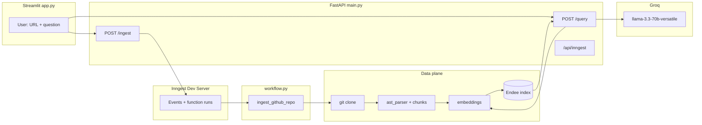

# AI Codebase Intelligence

An **end-to-end system** that ingests a GitHub repository, builds **structured + semantic** chunks, stores them in **Endee** (vector database), and answers natural-language questions using **retrieval + Groq (LLaMA 3.3 70B)**. Long-running ingestion is orchestrated by **Inngest** so the API stays responsive. The **Streamlit** UI triggers ingest and Q&A.

---

## Screenshot placeholder (Streamlit UI + Inngest)

> **Add your screenshot here** — Replace the line below with a real image file in the repo (e.g. `docs/screenshots/streamlit-qna-inngest.png`) showing:
>
> 1. **Streamlit** — sidebar with GitHub URL, main area with a **question** and **Answer** / **Sources** for an ingested repo.  
> 2. **Inngest Dev Server** (optional in the same image or a second shot) — **Runs** tab with `ingest_github_repo` completing after `repo/ingest`.

```markdown
<!-- TODO: Save your screenshot as docs/screenshots/streamlit-qna-inngest.png then uncomment:


-->
```

The folder `docs/screenshots/` exists in the repo (`.gitkeep`) so you can drop the PNG there and reference it from the line above.

Until you add the file, you can paste the image in GitHub README edit UI or keep the HTML comment as a reminder.

---

## What this project does

| Stage | What happens |
|--------|----------------|
| **Ingest** | Clone repo → discover files → parse (Python AST + generic text) → chunk → embed (SentenceTransformers) → upsert vectors into Endee. |
| **Query** | Embed user question → similarity search in Endee → format snippets → LLM answers **only from retrieved context** → return answer + source labels. |

**Important:** `ENDEE_URL` must point to a **running Endee server**, not to FastAPI. FastAPI and Endee use **different ports**.

---

## Architecture



---

## Repository layout

```
Endee_ai_project/
├── app.py                 # Streamlit UI (ingest + ask + top_k)
├── main.py                # FastAPI: /ingest, /query, /ingest/status, /health, Inngest mount
├── workflow.py            # Inngest function ingest_github_repo + INGEST_STATUS
├── config.py              # load_dotenv(override=True), URLs, Inngest keys, collision check
├── ingestion.py           # git clone, file walk, cleanup temp dir
├── ast_parser.py          # Python AST chunks + parse_generic_file for .md/.js/...
├── chunks.py              # Build embedding text + metadata per item
├── embeddings.py          # SentenceTransformer all-MiniLM-L6-v2 (384-dim)
├── endee_store.py         # Endee client: index create/list, upsert, query
├── retrieval.py           # Query embedding + Endee search + prompt formatting
├── llm.py                 # Groq chat completions (grounded answers)
├── docker-compose.yml     # Local Endee (host 8001 → container 8080)
├── pyproject.toml         # Dependencies + console script codebase-api → main:main
├── .env.example           # Template for .env (no secrets)
├── .gitignore             # .env, .venv, endee-storage, build artifacts, etc.
└── README.md              # This file
```

Generated / local-only (not committed when ignored):

- **`.venv/`** — Python virtual environment (`uv sync`).
- **`endee-storage/`** — Local Endee data when using embedded storage (gitignored).
- **`__pycache__/`** — Bytecode.

---

## Tech stack

| Layer | Technology |
|--------|------------|
| UI | Streamlit (`app.py`) |
| API | FastAPI + Uvicorn (`main.py`) |
| Orchestration | Inngest Python SDK (`workflow.py`, route `/api/inngest`) |
| Parsing | `ast` for `.py`; whole-file text chunks for other extensions |
| Embeddings | `sentence-transformers` — `all-MiniLM-L6-v2` (384 dimensions) |
| Vector DB | Endee HTTP API (`endee` package) |
| LLM | Groq — `llama-3.3-70b-versatile` |
| Config | `python-dotenv` — project `.env` overrides OS env (`override=True`) |
| Packaging | `uv` / `setuptools`, Python **≥ 3.12** |

---

## Prerequisites

- **Python 3.12+**, **Git** (for `git clone` during ingest).
- **Docker** (recommended) to run **Endee** via `docker-compose.yml`.
- **Node.js** (for `npx inngest-cli`) if you use the Inngest Dev Server locally.
- Accounts/keys: **Groq API key**; optional **GitHub token** for private repos.

---

## Environment variables

Copy `.env.example` to `.env` and fill in values. The app loads **only** `.env` from the project root.

| Variable | Purpose |
|----------|---------|
| `GROQ_API_KEY` | Required for `/query` LLM calls. |
| `GITHUB_TOKEN` | Optional; private repo clone. |
| `ENDEE_URL` | **Endee server root** (e.g. `http://127.0.0.1:8001`). **Must not** be the same host:port as FastAPI. |
| `API_BASE_URL` | Where Streamlit calls the API (default `http://127.0.0.1:8000`). |
| `INNGEST_EVENT_KEY` | Dev placeholder `local` is fine locally. |
| `INNGEST_SIGNING_KEY` | Leave **empty** for local Inngest (do not use the string `local`). |
| `INNGEST_DEV` | `1` for dev server mode. |
| `INNGEST_REQUEST_TIMEOUT_MS` | Optional; default long timeout for slow steps. |

---

## Endee vector database (required)

Ingest and search need a **live Endee** instance at `ENDEE_URL`.

From the project root:

```bash
docker compose up -d
docker compose ps
docker compose logs -f endee
```

The bundled `docker-compose.yml` maps **host port 8001** to the container’s **8080** (Endee’s default). Keep:

```env
ENDEE_URL=http://127.0.0.1:8001
```

Official docs: [Endee Quick Start](https://docs.endee.io/quick-start).

---

## How to run (four processes)

Use **four terminals** from the project directory after `uv sync`.

### 0. Endee (Docker)

```bash
docker compose up -d
```

### 1. FastAPI + Inngest HTTP handler

```bash
uv run uvicorn main:app --host 127.0.0.1 --port 8000
```

Or: `uv run codebase-api` / `uv run python main.py` (see `pyproject.toml`).

- **Health:** `GET http://127.0.0.1:8000/health`
- **Inngest:** `GET/PUT/POST http://127.0.0.1:8000/api/inngest`

Avoid `--reload` during long ingests if you see dropped connections.

### 2. Inngest Dev Server

Must target **the same host:port as FastAPI**, not Endee:

```bash
npx inngest-cli@latest dev -u http://127.0.0.1:8000/api/inngest
```

Dashboard: usually `http://127.0.0.1:8288` (CLI prints URLs).

### 3. Streamlit

```bash
uv run streamlit run app.py
```

Default Streamlit port: **8501**. The UI calls `API_BASE_URL` for `/ingest`, `/ingest/status`, and `/query`.

---

## Workflows

### A. Ingest (`repo/ingest`)

1. User enters a GitHub URL in Streamlit → `POST /ingest` with `{ "repo_url": "..." }`.
2. API sets ingest status to **running** and sends Inngest event `repo/ingest`.
3. Inngest invokes **`ingest_github_repo`** (`workflow.py`):
   - **`clone_repo`** — shallow git clone to a temp directory (in a thread).
   - **`get_code_files`** — walk tree; extensions include `.py`, `.md`, `.js`, `.ts`, `.html` (see `ingestion.py`).
   - **`clear_old_index`** — delete/recreate the Endee index name `code_intelligence` so a new ingest replaces old vectors.
   - **`parse_and_chunk_files`** — Python: functions/classes/module via AST; other files: one chunk per file (`parse_generic_file`).
   - **`embed_and_insert_batch_*`** — batches of 50 chunks; embed + upsert (blocking work in `asyncio.to_thread`).
   - **`cleanup_repo`** — remove temp clone.
   - **`mark_done`** — sets `INGEST_STATUS["status"]` to `completed` (or error path sets `error`).
4. Streamlit polls `GET /ingest/status` until **completed** or **error**.

### B. Query

1. User enters question and optional **top_k** (number of chunks).
2. `POST /query` with `{ "query": "...", "top_k": N }`.
3. `retrieve_context` embeds the query, queries Endee, collects `meta` payloads.
4. `format_context` builds the text block for the LLM.
5. `generate_answer` calls Groq with a **context-only** system prompt.
6. Response: `answer` + `sources` (file / type / name strings).

---

## HTTP API summary

| Method | Path | Description |
|--------|------|-------------|
| GET | `/health` | `{ "ok": true }` |
| POST | `/ingest` | Body: `{ "repo_url": string }` — queues Inngest ingest |
| GET | `/ingest/status` | `{ "status": "idle" \| "running" \| "completed" \| "error" }` |
| POST | `/query` | Body: `{ "query": string, "top_k"?: number }` |
| * | `/api/inngest` | Inngest SDK — sync and step execution |

---

## Module reference (short)

| Module | Role |
|--------|------|
| `config.py` | Env loading; `endee_url_collides_with_api()` prevents FastAPI/Endee port mix-up. |
| `ingestion.py` | `clone_repo`, `get_code_files`, `cleanup_repo`. |
| `ast_parser.py` | `parse_python_file`, `parse_generic_file`. |
| `chunks.py` | Rich text + metadata for embedding. |
| `embeddings.py` | Model load, `generate_embeddings` / `generate_embedding`. |
| `endee_store.py` | `EndeeDB`: list/create index, upsert, query; UUID vector ids. |
| `retrieval.py` | `retrieve_context`, `format_context`. |
| `llm.py` | Groq chat with grounded prompt. |
| `workflow.py` | Inngest client, `ingest_github_repo`, `INGEST_STATUS`. |
| `main.py` | FastAPI app, lifespan preloads encoder, Inngest `serve`. |
| `app.py` | Streamlit: ingest polling, `top_k`, Q&A display. |

---

## Troubleshooting

- **`Connection refused` to port 8001** — Endee is not running. Run `docker compose up -d` or point `ENDEE_URL` at your real Endee URL.
- **`404` on `/api/v1/...` while `ENDEE_URL` looks like port 8000** — You pointed Endee at **FastAPI**. Use a separate port for Endee (e.g. 8001).
- **`.env` ignored** — Project uses `load_dotenv(..., override=True)` so `.env` wins over shell. Restart processes after edits.
- **Inngest “can’t find app” during ingest** — Heavy work runs in background threads; avoid starving the server. Don’t use `--reload` during long runs if connections drop.
- **Empty search results** — Ingest must finish with **`indexed_chunks` > 0**; check Inngest run output. Ensure Groq key is set for answers.

---

## License / security

- Do **not** commit `.env` (contains secrets). Use `.env.example` as a template.
- Rotate API keys if they were ever committed or shared.

---

## Console script

`pyproject.toml` defines:

```text
codebase-api = main:main
```

So `uv run codebase-api` starts Uvicorn on `127.0.0.1:8000` (see `main.py`).
