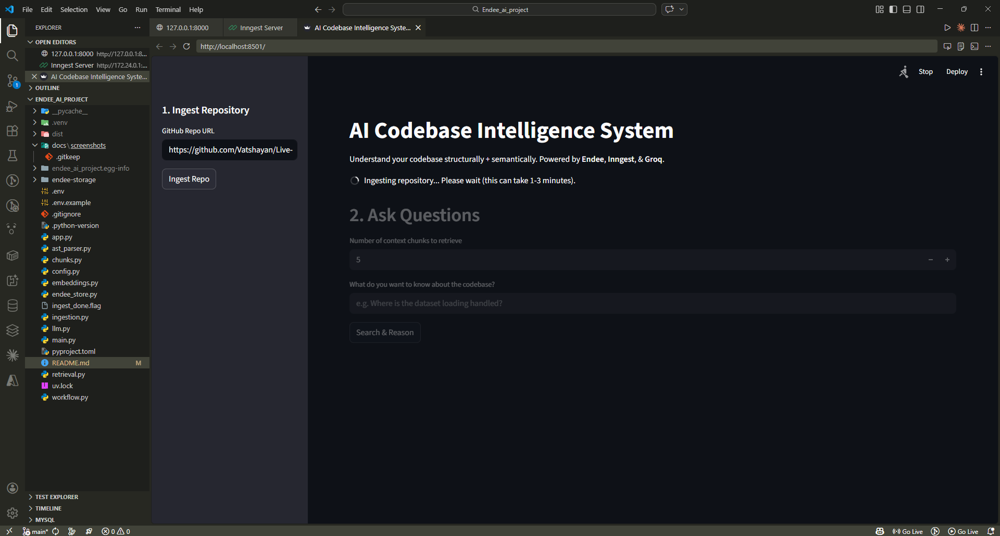
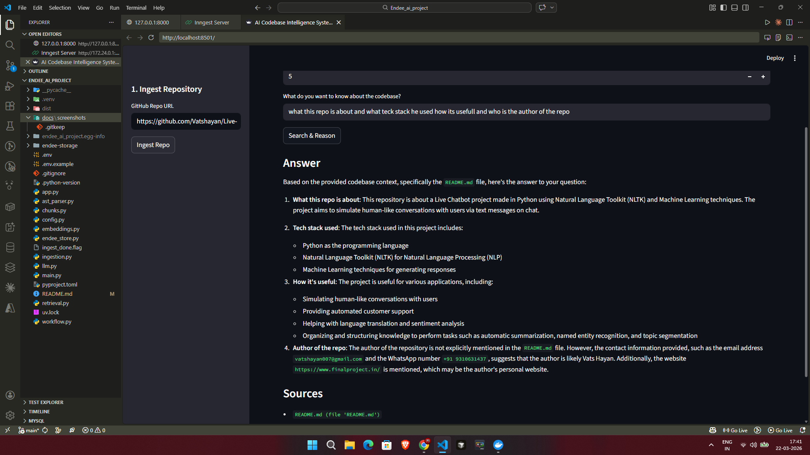
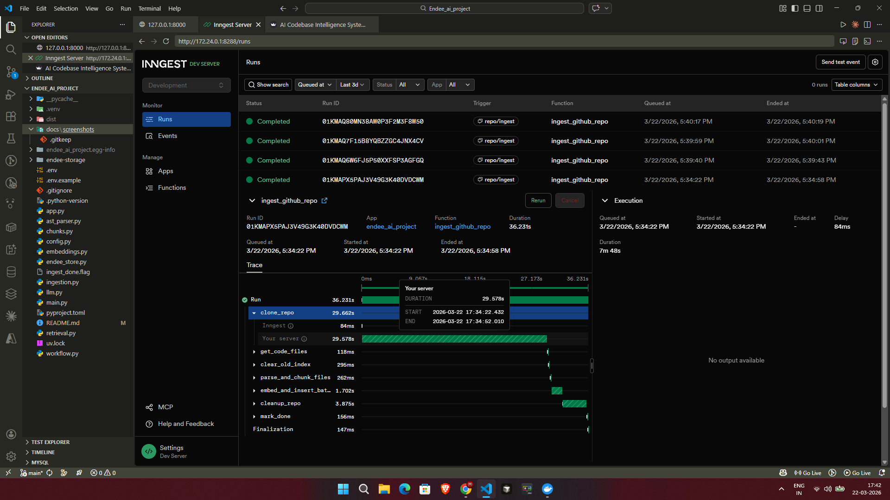

# AI Codebase Intelligence System 🧠💻

An **end-to-end, locally-hostable AI Codebase Intelligence System**. This platform enables you to ingest any GitHub repository, build **structured and semantic code chunks**, store them directly into an **Endee Vector Database**, and answer highly complex natural-language questions about that codebase using **Retrieval-Augmented Generation (RAG)** powered by **Groq (LLaMA 3.3 70B)**.

Heavy, long-running repository ingestions are seamlessly orchestrated in the background by **Inngest**, keeping the API incredibly fast and responsive while real-time UI polling presents an intuitive frontend experience for the user via **Streamlit**.

---

## 📸 Visual Walkthrough

> **Image 1: Streamlit UI - Ingestion & Waiting Spinner**  
> *(Showcase the sidebar where the GitHub URL is entered, and the active waiting spinner as the codebase is processed in the background.)*  



> **Image 2: Streamlit UI - Codebase Q&A**  
> *(Showcase the main question interface answering a complex question about the repo, successfully citing exact file names, functions, and module sources.)*  



> **Image 3: Inngest Dev Server - Run Trace**  
> *(Showcase the Inngest dashboard at http://localhost:8288 highlighting a completed `ingest_github_repo` run with the `clear_old_index` and `embed_and_insert_batch` steps glowing green.)*  


---

## 💡 Practical Use Cases & Examples

This intelligence system is built for developers, code reviewers, and system architects who need to intimately understand unfamiliar codebases without spending hours tracing files manually.

**Example Scenarios:**
- **Onboarding Faster:** Provide a GitHub URL to a complex enterprise repository and instantly ask: *"Where does the user authentication flow begin, and what hashing algorithm is used for passwords?"*
- **Code Auditing & Refactoring:** Analyze interconnected structures by asking: *"List all the components in the codebase that directly interact with the database session manager."*
- **Bug Tracking Insight:** Paste a confusing traceback error into the prompt and ask: *"I'm getting a NullPointerException in the payload validation stage. Which Python file manages the primary payload schemas?"*
- **Dependency & Stack Mapping:** Intuit library usage by asking: *"Does this application use asynchronous requests, and if so, what module configures the client?"*

---

## 🚀 How It Works: Detailed Workflows

The intelligence system operates on two incredibly robust parallel workflows:

### 1. The Ingestion Workflow (`repo/ingest`)
When a user submits a GitHub repository URL into the Streamlit UI, the system executes a deeply integrated background pipeline to process the code smoothly without blocking the UI:
1. **Trigger & Polling:** FastAPI sets an in-memory `INGEST_STATUS` flag to `"running"` and triggers an Inngest event. Streamlit continuously polls `/ingest/status` to show the user a loading spinner.
2. **Git Clone:** Inngest performs a shallow clone of the target repo to a temporary directory.
3. **File Discovery:** The crawler locates all valid files (`.py`, `.md`, `.js`, `.ts`, `.html`).
4. **Clean Slate Vector Index:** The `clear_old_index` step securely connects to Endee and drops the previous vector index, ensuring that codebase context never overlaps between different repositories. 
5. **AST Parsing & Chunking:** Python files are dynamically parsed using Abstract Syntax Trees (AST) to extract discrete classes, modules, and functions. Other files fall back to a generic chunker. 
6. **Collision-Proof Embedding & Upserting:** Chunks are embedded using `sentence-transformers` and bundled in batches of 50. Every chunk is assigned a purely random **UUID** to completely bypass any duplicate ID collisions in the vector database.
7. **Cleanup & Completion:** The temp repository is securely wiped from disk, and `INGEST_STATUS` flips to `"completed"`, telling Streamlit to release the spinner.

### 2. The Question & Answer Workflow (`/query`)
1. **Context Retrieval:** The user's query is embedded and cross-referenced mathematically against the Endee vector database to retrieve the top `N` chunks based on Cosine Similarity.
2. **LLM Prompting:** The `retrieve_context` explicitly formats the retrieved raw codes and docstrings constraint into a strictly bounded system prompt.
3. **Reasoning:** `Groq` evaluates the codebase chunks, generating an intelligent, highly cohesive answer while identifying exactly which file streams generated that specific thought process.

---

## 🏗️ Project Architecture & File Structure

```text
Endee_ai_project/
├── app.py                 # 🖥️ Streamlit UI. Handles URL input, active background polling (spinner), `top_k` chunk adjustments, and displaying LLM reasoning.
├── main.py                # ⚙️ FastAPI Backend. Serves `/ingest`, `/query`, and the fast `/ingest/status` in-memory polling endpoint. Connects to Inngest SDK.
├── workflow.py            # 🔄 Background Orchestration. Contains the `ingest_github_repo` Inngest function, dictating the precise clone -> parse -> clear -> embed -> cleanup lifecycle.
├── config.py              # 🔐 Environment Loader. Validates `.env` variables and prevents port collisions between FastAPI and the Endee DB.
├── ingestion.py           # 📂 File Operations. Logic for safely executing `git clone`, walking the directory tree, and scrubbing temporary data.
├── ast_parser.py          # 🌲 Syntax Parser. Uses Python's native `ast` library to logically split Python code into functional objects, plus generic file text chunking.
├── chunks.py              # 🧩 Chunk Structuring. Formats the parsed AST data into standard JSON schemas with extremely detailed metadata for the Vector DB.
├── embeddings.py          # 🧠 Embedding Engine. Wraps the local `sentence-transformers` (all-MiniLM-L6-v2) to map code strings into 384-dimensional dense vectors.
├── endee_store.py         # 🗄️ Endee DB Client. The crucial wrapper for creating/wiping indices, querying exact similarities, and safely executing UUID-based chunk upserts.
├── retrieval.py           # 🔍 Context Formatter. Bridging code mapping Endee vector query results into structured prompt injections for the LLM.
├── llm.py                 # 🤖 Large Language Model. Interacts with the fast Groq API natively (requires `llama-3.3-70b-versatile`).
├── docker-compose.yml     # 🐳 Docker Config. Stands up the blazing-fast local Endee Vector Database server.
├── .gitignore             # 🚫 Git Exclusions. Secures `.env` secrets, `__pycache__`, `*.flag` debug states, and environment lockers from GitHub tracking.
└── README.md              # 📖 This documentation file.
```

---

## 🛠️ Tech Stack

| Layer | Technology |
|--------|------------|
| **Frontend UI** | Streamlit |
| **API Backend** | FastAPI + Uvicorn |
| **Orchestration** | Inngest Python SDK |
| **Parser / Extractor** | Python `ast` module |
| **Embeddings** | `sentence-transformers` (`all-MiniLM-L6-v2` / 384 dimensions) |
| **Vector Database** | Endee HTTP API (Local Docker) |
| **LLM Engine** | Groq API (`llama-3.3-70b-versatile`) |

---

## 💻 Getting Started

### 1. Prerequisites
- **Python 3.12+**
- **Git** (for downloading repositories)
- **Docker** (Required to run the Endee server locally)
- **Node.js** (Required for the `npx inngest-cli` dev server)
- **Groq API Key** (Get yours at [console.groq.com](https://console.groq.com/))

### 2. Environment Variables
Copy `.env.example` to a new `.env` file in the project root:
```env
GROQ_API_KEY="gsk_..."
ENDEE_URL="http://127.0.0.1:8001"
API_BASE_URL="http://127.0.0.1:8000"
INNGEST_EVENT_KEY="local"
INNGEST_SIGNING_KEY=""
INNGEST_DEV=1
```

### 3. Running the Architecture (4 Terminals Required)

To run the application, you must spin up the interconnected processes. Open **Four Terminals** in your project root:

**Terminal 1: Start the Vector Database**
```bash
docker compose up -d
```
*(Endee locally mounts on port 8001 to prevent conflicts with FastAPI)*

**Terminal 2: Start the FastAPI Backend**
```bash
uv run uvicorn main:app --host 127.0.0.1 --port 8000
```
*(Do not use `--reload` during heavy ingestions as it can artificially drop the background connection)*

**Terminal 3: Start the Inngest Dev Server**
```bash
npx inngest-cli@latest dev -u http://127.0.0.1:8000/api/inngest
```
*(You can monitor the workflow background pipelines graphically at `http://127.0.0.1:8288`)*

**Terminal 4: Start the Streamlit UI**
```bash
uv run streamlit run app.py
```
*(Opens the primary interactive window at `http://localhost:8501`)*

---

## 👤 Author
**[pardhu01010](https://github.com/pardhu01010)**

Made with ❤️ using Python, FastAPI, Streamlit, Endee, Inngest, and Groq.
